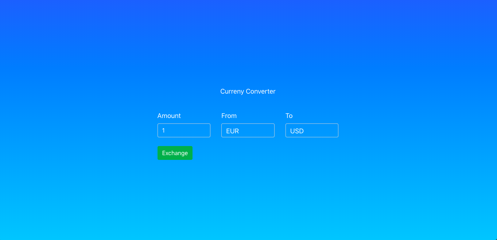

This project was bootstrapped with [Create React App](https://github.com/facebook/create-react-app).

## Setup
1. Clone this repository with `git@github.com:gersly/day1-signup-client.git`.
1. Install the dependencies with `npm install `.
1. Run using Node.

## Dependancies

- These can be found in the `./package.json` file

## File Structure 

Components are in a unique folder inside of the `./components` folder

## Styling

This app uses Bootstrap and FontAwesome

1. Bootstrap : `https://getbootstrap.com/docs/4.1/getting-started/introduction/`
1. FontAwesome: `https://kit.fontawesome.com/a076d05399.js`

## Screenshot 

